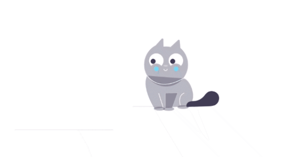

# Cat Animation - GSAP

Criando uma animação com SVG.
# <a href="https://cat-animation.netlify.app/" target="_blank">Deploy</a>

## Ferramentas utilizadas

* ReactJs
* GSAP
* Styled Components

## Iniciar Projeto

<b>1º Clone esse repositório no seu computador ou baixe no formato (ZIP).</b>

<b>2º Abra o seu terminal e na raiz do projeto rode o comando `npm install` ou `yarn` para baixar todas as depêndencias do projeto.</b>

<b>3º Rode o comando `npm start` ou `yarn start`.</b>

# Desenvolvido por Gustavo Scarpim:

